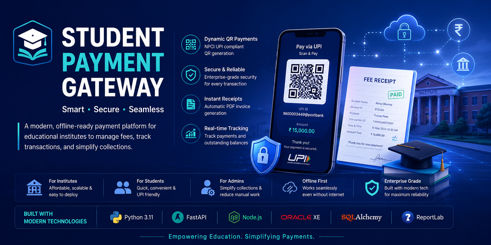
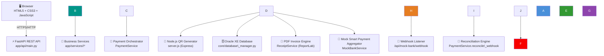
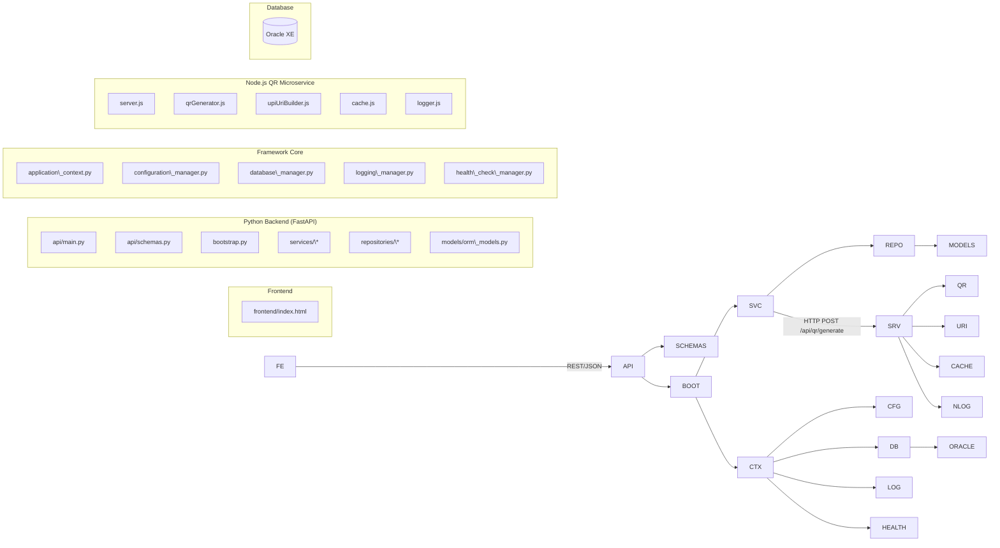
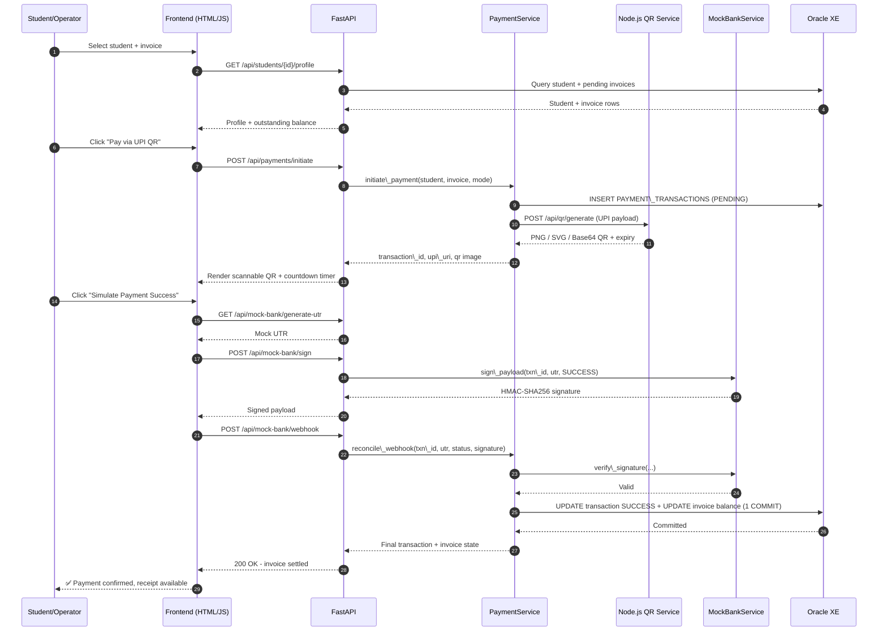
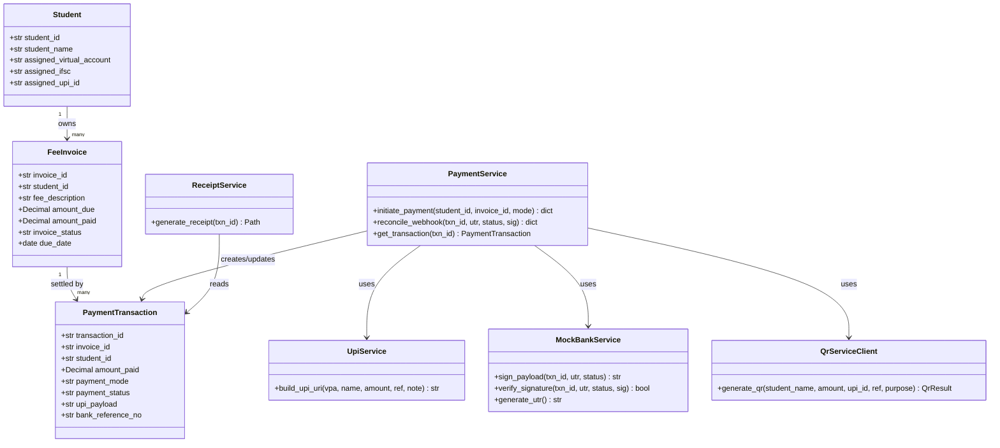
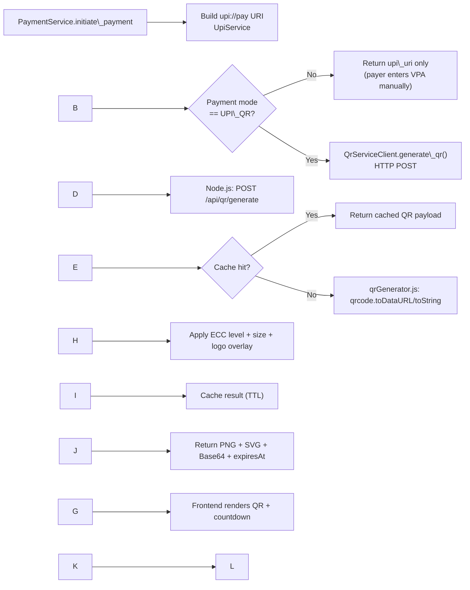
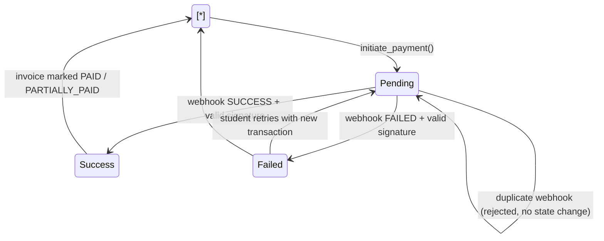
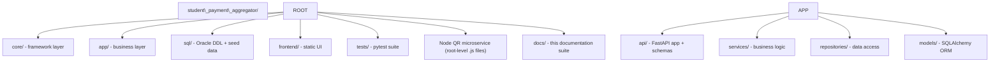
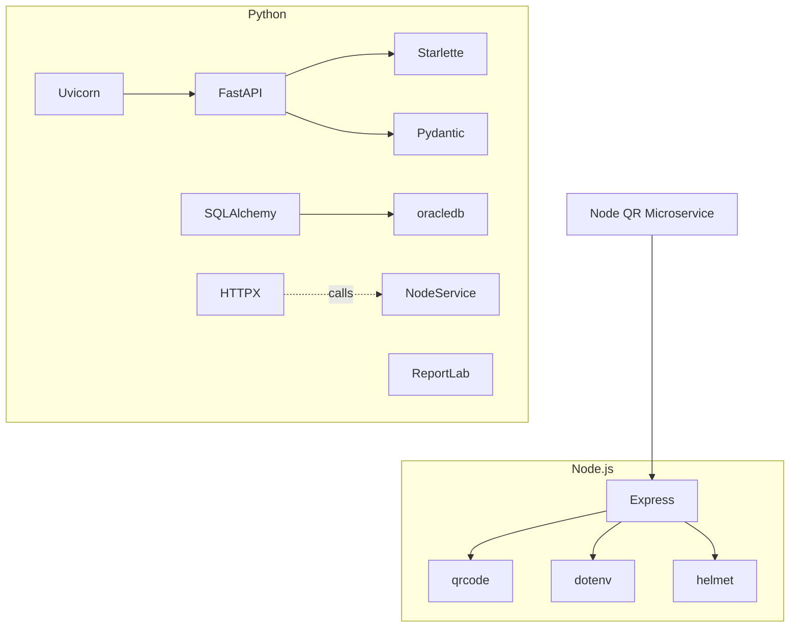
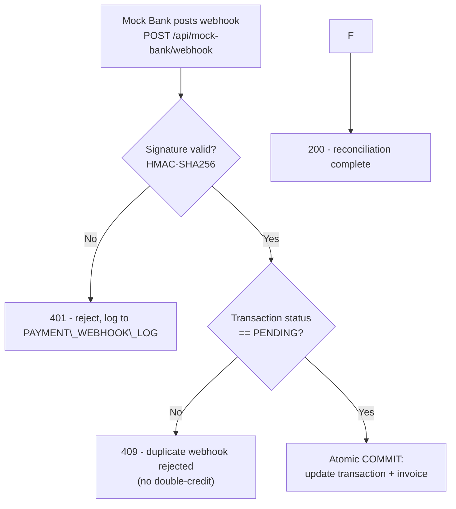

<div align="center">

<p align="center">
  
</p>

# 🎓💳 Student Smart Payment \& Fee Management Platform

### Enterprise-Grade, ERP-Neutral, 100% Offline Payment Aggregator for Educational Institutions

**No SAP. No Oracle Fusion. No PeopleSoft. No Workday. No Internet dependency.**

<br/>

[](#)
[](#)
[](#)
[](#)
[](#)
[](#)

[](https://github.com/hmahanta/student-payment-gateway/stargazers)
[](https://github.com/hmahanta/student-payment-gateway/network/members)
[](https://github.com/hmahanta/student-payment-gateway/issues)
[](https://github.com/hmahanta/student-payment-gateway)

<br/>

**A portable, self-hosted Smart Payment Aggregator for Schools, Colleges, Universities, Coaching Institutes, and Training Centers - with a reusable architecture for Hospital Billing, Hostel Fees, Library Fines, Donations, and Utility Bill Collection.**

[Getting Started](#-quick-start) •
[Architecture](#-architecture) •
[API Reference](./API_REFERENCE.md) •
[Documentation](#-documentation-index) •
[Contributing](./CONTRIBUTING.md) •
[Roadmap](./ROADMAP.md)

</div>

<br/>

> \[!NOTE]
> This platform runs \*\*entirely offline\*\* on a local Windows/Linux/macOS machine: local Oracle XE, local FastAPI backend, a local Node.js QR microservice, a mock bank webhook, and a single-file HTML frontend. No real payment gateway, no real money, no outbound network calls once dependencies are installed.

\---

## 📚 Table of Contents

<details>
<summary><strong>Click to expand</strong></summary>

1. [Executive Summary](#-executive-summary)
2. [Business Problem](#-business-problem)
3. [Solution Overview](#-solution-overview)
4. [Key Features](#-key-features)
5. [Business Benefits](#-business-benefits)
6. [Technology Stack](#-technology-stack)
7. [Architecture](#-architecture)
8. [Project Structure](#-project-structure)
9. [Quick Start](#-quick-start)
10. [Installation](#-installation)
11. [Configuration](#-configuration)
12. [Database Setup (Oracle XE)](#-database-setup-oracle-xe)
13. [Node.js QR Microservice Setup](#-nodejs-qr-microservice-setup)
14. [Running the Backend](#-running-the-backend)
15. [Running the Frontend](#-running-the-frontend)
16. [Offline Testing Walkthrough](#-offline-testing-walkthrough)
17. [API Documentation](#-api-documentation)
18. [Screenshots](#-screenshots)
19. [Payment Flow](#-payment-flow)
20. [Webhook Flow](#-webhook-flow)
21. [Database Design](#-database-design)
22. [Security](#-security)
23. [Logging \& Observability](#-logging--observability)
24. [Performance Notes](#-performance-notes)
25. [Testing](#-testing)
26. [Deployment](#-deployment)
27. [Troubleshooting](#-troubleshooting)
28. [Known Limitations](#-known-limitations)
29. [Roadmap](#-roadmap)
30. [Contributing](#-contributing)
31. [Documentation Index](#-documentation-index)
32. [License](#-license)
33. [Support](#-support)
34. [Acknowledgements](#-acknowledgements)

</details>

\---

## 🧭 Executive Summary

The **Student Smart Payment \& Fee Management Platform** is a self-contained, ERP-neutral fee collection system designed for educational institutions that cannot justify - financially or operationally - the cost and complexity of a commercial ERP payment module (SAP, Oracle Fusion, PeopleSoft, Workday).

It reproduces the shape of a real institutional payment stack - student/invoice management, a dynamic UPI QR payment experience, a pluggable payment-gateway adapter layer, asynchronous webhook reconciliation, PDF receipt generation, and audit-grade logging - while running **100% offline** against a local Oracle XE instance, so it can be evaluated, demoed, and iterated on a single laptop with no cloud dependency, no live payment gateway account, and no recurring cost.

It is built as a **reference architecture**: the business logic (`PaymentService`, `UpiService`, the repository layer) is deliberately decoupled from both "which database" and "which payment gateway," so the same core can later point at a real ERP's student tables and a real PSP (Razorpay, PhonePe, Google Pay, Paytm, BHIM) without changing the service layer or the REST contract.

## 🎯 Business Problem

> \[!IMPORTANT]
> Tier-2/Tier-3 institutions, standalone coaching centers, and small-to-mid-size colleges face a recurring problem: \*\*fee collection is fragmented, manual, and hard to reconcile.\*\*

|Pain Point|Consequence|
|-|-|
|Fee collection spread across cash, cheque, and ad-hoc UPI transfers|No single source of truth for what's been collected vs. outstanding|
|No dynamic, per-student QR/UPI experience|Manual VPA entry, higher error rate, slower collection cycles|
|No structured webhook/reconciliation flow|Manual bank statement reconciliation, delayed receipt issuance|
|Commercial ERP payment modules are cost-prohibitive|Institutions either overpay or under-invest in fee infrastructure|
|No audit trail for who collected what, when, and how|Difficult to pass institutional or statutory audits|

## 💡 Solution Overview

This platform addresses the above by providing:

* A **student \& invoice data model** (Oracle XE) that any institution can seed with its own data.
* A **Payment Orchestrator** (`PaymentService`) that creates a transaction, generates a dynamic UPI deep link, and - via a dedicated Node.js microservice - renders a scannable, NPCI-style QR code for it.
* A **Smart Payment Aggregator adapter layer**, so today's mock bank simulator can be swapped for a real PSP integration later without touching business code.
* A **webhook reconciliation engine** that verifies an HMAC-SHA256 signature and atomically updates both the transaction and the invoice balance in a single database transaction.
* A **PDF receipt engine** (ReportLab) capable of producing a professional, QR-and-barcode-bearing receipt per successful transaction.
* A **structured logging and audit-table foundation** (`PAYMENT\_AUDIT`, `PAYMENT\_STATUS\_HISTORY`, `PAYMENT\_WEBHOOK\_LOG`) for compliance and forensic review.
* A **single-file HTML/CSS/JS frontend** - no build tooling, no framework lock-in - that exercises the entire flow end-to-end.

## ✨ Key Features

<table>
<tr>
<td width="50%" valign="top">

**💰 Payment Engine**

* Multi-mode support: UPI QR, UPI ID, Net Banking, Cash, Cheque, Card
* Adapter-pattern gateway abstraction (future: Razorpay, PhonePe, Google Pay, Paytm, BHIM, ICICI, HDFC, SBI)
* Idempotent transaction creation
* Duplicate-webhook rejection (no double-credit)
* Graceful degradation if the QR microservice is unreachable

**📱 Dynamic QR Generation**

* Dedicated Node.js/Express microservice
* NPCI-compliant `upi://pay` URI construction
* PNG, SVG, and Base64 output
* Configurable size, ECC level, and logo overlay
* In-memory TTL cache to avoid re-encoding repeat requests
* Countdown-timer-ready expiry timestamps

**🏦 Mock Smart Bank Simulator**

* HMAC-SHA256 signed webhook callbacks
* Replay-protection-ready signature verification
* Random UTR generation for demo/testing

</td>
<td width="50%" valign="top">

**🧾 Receipts \& Reporting**

* ReportLab-based professional PDF receipts (QR, barcode, PAID stamp, digital-signature placeholder)
* Dashboard summary, daily collection, pending/collected/failed fees
* Student ledger, payment register, reconciliation report
* Audit trail and webhook log reports

**🗄️ Enterprise Oracle Schema**

* 8 tables: `STUDENTS`, `FEE\_INVOICES`, `PAYMENT\_TRANSACTIONS`, `PAYMENT\_AUDIT`, `PAYMENT\_STATUS\_HISTORY`, `PAYMENT\_GATEWAY\_CONFIG`, `PAYMENT\_WEBHOOK\_LOG`, `SYSTEM\_PARAMETERS`
* Full audit columns (`created\_by`, `created\_date`, `updated\_by`, `updated\_date`, `status`)
* Sequences, triggers, constraints, indexes - Oracle XE compatible
* Ships with sample data

**🔐 Security \& Observability**

* HMAC-SHA256 webhook signing
* Structured, correlation-ID-tagged JSON logging (Python and Node side)
* Typed exception hierarchy with consistent HTTP status mapping
* Health-check pre-flight on startup (env, config, folders, DB, disk)

**🖥️ Offline-First Frontend**

* Pure HTML/CSS/JS - no React, Angular, or Vue
* Dashboard, student search, dynamic QR, transaction timeline, dark/light mode

</td>
</tr>
</table>

## 📈 Business Benefits

|Benefit|Detail|
|-|-|
|**Zero licensing cost**|No SAP/Oracle Fusion/PeopleSoft/Workday subscription required|
|**Fast time-to-pilot**|A single laptop with Oracle XE + Node.js + Python can run the full stack in under an hour|
|**Vendor-neutral**|Adapter pattern means no lock-in to a specific payment gateway or ERP|
|**Auditable by design**|Every transaction, status transition, and webhook call has a dedicated audit table|
|**Reusable core**|The same architecture generalizes to hostel fees, library fines, donations, and utility billing|
|**Low operational risk during evaluation**|100% offline - no real money, no real gateway, no data leaves the machine|

## 🛠️ Technology Stack

<div align="center">

|Layer|Technology|Version|
|-|-|-|
|**Backend Framework**|FastAPI|0.115.x|
|**ASGI Server**|Uvicorn|0.30.x|
|**Language (Backend)**|Python|3.11.9|
|**ORM**|SQLAlchemy|2.x|
|**Database**|Oracle Database XE|18c / 21c|
|**DB Driver**|`oracledb` (thin mode)|2.4.x|
|**QR Microservice**|Node.js + Express|LTS (≥18)|
|**QR Rendering**|`qrcode` npm package|1.5.x|
|**PDF Generation**|ReportLab|4.2.x|
|**Frontend**|HTML5, CSS3, vanilla JavaScript|-|
|**Testing**|pytest, FastAPI `TestClient`|8.3.x|
|**Containerization**|Docker, Docker Compose|-|
|**CI/CD**|GitHub Actions|-|

</div>

> \[!TIP]
> Every dependency above is pinned in \[`requirements.txt`](./requirements.txt) and \[`package.json`](./package.json) for reproducible installs. See \[`pyproject.toml`](./pyproject.toml) for tooling configuration (Black, Flake8, pytest).

\---

## 🏗️ Architecture

### System Architecture



### Component Diagram



### Sequence Diagram - End-to-End Payment



### Deployment Diagram

```mermaid
flowchart TB
    subgraph "Local Machine (Windows 11 / Linux / macOS)"
        direction TB
        subgraph "Process 1"
            UV\["Uvicorn :8000<br/>FastAPI app"]
        end
        subgraph "Process 2"
            ND\["Node.js :4000<br/>QR Microservice"]
        end
        subgraph "Process 3"
            HTTP\["Static Server :5500<br/>(or file://)"]
        end
        subgraph "Process 4"
            ORA\[("Oracle XE :1521<br/>XEPDB1")]
        end
        BR\["🌐 Browser"]

        BR --> HTTP
        BR -->|fetch()| UV
        UV -->|httpx| ND
        UV -->|oracledb thin| ORA
    end
```

### Class Diagram - Core Domain



### Database ER Diagram

```mermaid
erDiagram
    STUDENTS ||--o{ FEE\_INVOICES : has
    FEE\_INVOICES ||--o{ PAYMENT\_TRANSACTIONS : settled\_by
    PAYMENT\_TRANSACTIONS ||--o{ PAYMENT\_STATUS\_HISTORY : tracks
    PAYMENT\_TRANSACTIONS ||--o{ PAYMENT\_WEBHOOK\_LOG : logged\_by
    PAYMENT\_TRANSACTIONS ||--o{ PAYMENT\_AUDIT : audited\_by

    STUDENTS {
        varchar student\_id PK
        varchar student\_name
        varchar assigned\_virtual\_account
        varchar assigned\_ifsc
        varchar assigned\_upi\_id
        varchar created\_by
        date created\_date
    }
    FEE\_INVOICES {
        varchar invoice\_id PK
        varchar student\_id FK
        varchar fee\_description
        number amount\_due
        number amount\_paid
        varchar invoice\_status
        date due\_date
    }
    PAYMENT\_TRANSACTIONS {
        varchar transaction\_id PK
        varchar invoice\_id FK
        varchar student\_id FK
        number amount\_paid
        varchar payment\_mode
        varchar payment\_status
        varchar upi\_payload
        varchar bank\_reference\_no
    }
    PAYMENT\_STATUS\_HISTORY {
        number history\_id PK
        varchar transaction\_id FK
        varchar old\_status
        varchar new\_status
        date changed\_at
    }
    PAYMENT\_WEBHOOK\_LOG {
        number log\_id PK
        varchar transaction\_id FK
        varchar gateway\_code
        varchar raw\_payload
        number signature\_valid
        date received\_at
    }
    PAYMENT\_AUDIT {
        number audit\_id PK
        varchar entity\_name
        varchar entity\_id
        varchar action
        varchar performed\_by
        date performed\_at
    }
    PAYMENT\_GATEWAY\_CONFIG {
        varchar gateway\_code PK
        varchar display\_name
        varchar status
    }
    SYSTEM\_PARAMETERS {
        varchar param\_key PK
        varchar param\_value
    }
```

### QR Generation Flow



### Student Payment Lifecycle (State Diagram)



### Repository Structure Diagram



### Dependency Diagram



\---

## 📁 Project Structure

```text
student\_payment\_aggregator/
│
├── 📂 core/                          # Reusable enterprise framework (DB/env/logging/health)
│   ├── application\_context.py        # Framework composition root
│   ├── configuration\_manager.py
│   ├── database\_manager.py           # Oracle XE via oracledb (thin mode) + SQLAlchemy
│   ├── environment\_manager.py
│   ├── exception\_manager.py          # ApplicationError hierarchy
│   ├── folder\_manager.py
│   ├── health\_check\_manager.py
│   └── logging\_manager.py
│
├── 📂 app/                           # Business/domain layer
│   ├── config.py                     # Business configuration
│   ├── constants.py                  # PaymentMode / PaymentStatus / InvoiceStatus
│   ├── exceptions.py                  # Domain exceptions
│   ├── bootstrap.py                    # Wires framework + business services
│   ├── 📂 models/
│   │   └── orm\_models.py               # SQLAlchemy ORM models (8 tables)
│   ├── 📂 repositories/
│   │   ├── student\_repository.py
│   │   ├── invoice\_repository.py
│   │   ├── payment\_repository.py
│   │   └── reports\_repository.py
│   ├── 📂 services/
│   │   ├── student\_service.py
│   │   ├── invoice\_service.py
│   │   ├── upi\_service.py
│   │   ├── payment\_service.py          # Payment Orchestrator
│   │   ├── mock\_bank\_service.py         # Mock Smart Payment Aggregator
│   │   ├── qr\_service\_client.py          # HTTP client → Node.js QR service
│   │   ├── receipt\_service.py             # ReportLab PDF receipts
│   │   ├── audit\_service.py               # Audit trail writer
│   │   └── reports\_service.py              # Reporting facade
│   └── 📂 api/
│       ├── main.py                          # FastAPI application
│       └── schemas.py                        # Pydantic request/response models
│
├── 📂 sql/                           # Oracle DDL (Oracle XE compatible)
│   ├── 01\_create\_tables.sql          # STUDENTS, FEE\_INVOICES, PAYMENT\_TRANSACTIONS
│   ├── 02\_seed\_sample\_data.sql
│   ├── 03\_migrate\_add\_audit\_columns.sql
│   ├── 04\_create\_enterprise\_tables.sql   # Audit + reporting tables
│   └── 05\_system\_parameters\_seed.sql
│
├── 📂 frontend/
│   └── index.html                    # Single-file offline UI
│
├── 📂 tests/
│   └── test\_payment\_flow.py          # Integration tests (real Oracle XE)
│
├── 📂 docs/                          # Extended documentation (this suite)
│   ├── architecture/
│   ├── images/
│   ├── screenshots/
│   ├── diagrams/
│   └── examples/
│
├── 📂 .github/                       # Issue/PR templates, workflows, CODEOWNERS
│
├── server.js                         # Node/Express QR microservice entry point
├── qrGenerator.js                    # qrcode wrapper (PNG/SVG/Base64, ECC, logo)
├── upiUriBuilder.js                  # NPCI-style upi://pay URI builder
├── cache.js                          # In-memory TTL cache
├── logger.js                         # Structured JSON logger
├── package.json                      # Node dependencies
├── env.template                      # Node service .env template
│
├── .env.template                     # Python .env template
├── requirements.txt
├── pyproject.toml
├── Dockerfile
├── docker-compose.yml
├── Makefile
└── README.md                         # You are here
```

\---

## 🚀 Quick Start

```bash
# 1. Clone
git clone https://github.com/your-org/student-payment-aggregator.git
cd student-payment-aggregator

# 2. Python backend
python3 -m venv .venv
source .venv/bin/activate            # Windows: .venv\\Scripts\\activate
pip install -r requirements.txt
cp .env.template .env                # then edit DB credentials

# 3. Node.js QR microservice
npm install
npm start \&                          # listens on http://127.0.0.1:4000

# 4. Oracle XE - run sql/01 through sql/05 against your schema (see below)

# 5. Run the API
uvicorn app.api.main:app --reload --host 127.0.0.1 --port 8000

# 6. Open the frontend
#    Just open frontend/index.html in a browser, or:
cd frontend \&\& python3 -m http.server 5500
```

> \[!TIP]
> Full step-by-step instructions (including Oracle XE installation) are in \[`INSTALLATION.md`](./INSTALLATION.md).

\---

## 📦 Installation

See [`INSTALLATION.md`](./INSTALLATION.md) for the complete, OS-specific installation guide. Summary:

|Requirement|Version|Notes|
|-|-|-|
|Windows|11|Also runs on Linux/macOS|
|Python|3.11.9|Virtual environment strongly recommended|
|Node.js|LTS (≥ 18)|Required for the QR microservice|
|Oracle Database XE|18c or 21c|Local install; `XEPDB1` pluggable DB|
|VS Code|Latest|Recommended IDE, not required|

```bash
python3 -m venv .venv
source .venv/bin/activate
pip install -r requirements.txt
npm install
```

`oracledb` runs in **thin mode by default** - no separate Oracle Instant Client install is required.

\---

## ⚙️ Configuration

Copy and edit both environment templates:

```bash
cp .env.template .env        # Python backend
cp env.template .env          # Node.js QR microservice (optional - sane defaults exist)
```

<details>
<summary><strong>Key Python (.env) variables</strong></summary>

|Variable|Purpose|Default|
|-|-|-|
|`DB\_HOST` / `DB\_PORT` / `DB\_SERVICE`|Oracle XE connection|`localhost` / `1521` / `XEPDB1`|
|`DB\_USER` / `DB\_PASSWORD`|Application schema credentials|-|
|`MOCK\_BANK\_WEBHOOK\_SECRET`|HMAC secret for the mock webhook|-|
|`QR\_SERVICE\_BASE\_URL`|Node.js QR microservice URL|`http://127.0.0.1:4000`|
|`QR\_PAYLOAD\_TTL\_SECONDS`|QR expiry countdown|`900`|
|`MERCHANT\_NAME`|Displayed on receipts/QR|`Demo University`|
|`LOG\_LEVEL` / `LOG\_JSON`|Logging verbosity/format|`INFO` / `false`|

</details>

<details>
<summary><strong>Key Node.js (env.template) variables</strong></summary>

|Variable|Purpose|Default|
|-|-|-|
|`QR\_SERVICE\_PORT`|Port the microservice listens on|`4000`|
|`QR\_DEFAULT\_TTL\_SECONDS`|Default QR expiry|`900`|
|`QR\_DEFAULT\_SIZE\_PX`|QR image dimensions|`300`|
|`QR\_DEFAULT\_ECC\_LEVEL`|Error-correction level (L/M/Q/H)|`M`|
|`QR\_CACHE\_TTL\_SECONDS`|In-memory cache TTL|`120`|

</details>

\---

## 🗄️ Database Setup (Oracle XE)

1. Install **Oracle Database XE** (18c/21c) and note the `SYS`/`SYSTEM` password.
2. Create a dedicated application schema (never use `SYSTEM` directly):

```sql
ALTER SESSION SET CONTAINER = XEPDB1;
CREATE USER payment\_app IDENTIFIED BY change\_me;
GRANT CONNECT, RESOURCE, CREATE VIEW TO payment\_app;
ALTER USER payment\_app QUOTA UNLIMITED ON USERS;
```

3. Run the DDL/seed scripts **in order**:

```bash
sqlplus payment\_app/change\_me@localhost:1521/XEPDB1
SQL> @sql/01\_create\_tables.sql
SQL> @sql/02\_seed\_sample\_data.sql
SQL> @sql/03\_migrate\_add\_audit\_columns.sql
SQL> @sql/04\_create\_enterprise\_tables.sql
SQL> @sql/05\_system\_parameters\_seed.sql
```

> \[!WARNING]
> Scripts `04` and `05` create the enterprise audit/reporting tables (`PAYMENT\_AUDIT`, `PAYMENT\_STATUS\_HISTORY`, `PAYMENT\_WEBHOOK\_LOG`, `PAYMENT\_GATEWAY\_CONFIG`, `SYSTEM\_PARAMETERS`) referenced by the ORM models. Run them even if you don't need reporting immediately - skipping them will not break the core payment flow, but will break anything touching those tables.

Full schema reference: [`DATABASE.md`](./DATABASE.md).

\---

## 📡 Node.js QR Microservice Setup

The FastAPI backend never generates QR images itself - it delegates to a dedicated Express microservice, per the platform's swappable-gateway architecture.

```bash
npm install
cp env.template .env      # optional
npm start                 # http://127.0.0.1:4000
curl http://127.0.0.1:4000/health
```

If this service is temporarily unreachable, `PaymentService.initiate\_payment` degrades gracefully - the transaction is still created with a raw `upi://pay` string, just without a rendered QR image. **A down QR service never blocks fee collection.**

\---

## ▶️ Running the Backend

```bash
uvicorn app.api.main:app --reload --host 127.0.0.1 --port 8000
```

On startup, `ApplicationContext.bootstrap()` runs pre-flight health checks (env vars, config, folders, disk space, DB connectivity, required tables) and prints a PASS/WARNING/FAIL report.

```bash
curl http://127.0.0.1:8000/api/health
```

Interactive API docs: **http://127.0.0.1:8000/docs**

\---

## 🖥️ Running the Frontend

```bash
# Option A - open directly
open frontend/index.html   # or double-click it

# Option B - serve it (recommended)
cd frontend
python3 -m http.server 5500
```

Then visit `http://127.0.0.1:5500` and confirm the "Backend base URL" field matches your Uvicorn address.

\---

## 🧪 Offline Testing Walkthrough

1. Ensure the Node QR service, Uvicorn, and Oracle XE are all running.
2. Select a student (e.g. **Rahul Verma - STU1002**) from the dropdown.
3. Pick a pending invoice, leave mode as `UPI\_QR`.
4. Click **Pay via UPI QR** → a scannable QR renders; transaction shows `PENDING`.
5. Click **🏦 Simulate Payment Success (Mock Bank)** → the backend signs and posts a mock webhook, verifies the signature, and atomically commits the transaction + invoice update.
6. UI refreshes: transaction badge turns green, invoice drops off the pending list.

\---

## 📖 API Documentation

Full reference with request/response schemas: [`API\_REFERENCE.md`](./API_REFERENCE.md).

|Method|Path|Description|
|-|-|-|
|`GET`|`/api/health`|Merged framework + business health report|
|`GET`|`/api/students`|List active students|
|`GET`|`/api/students/{student\_id}/profile`|Student profile + pending invoices|
|`POST`|`/api/payments/initiate`|Create a transaction; returns `upi\_uri` + QR (for `UPI\_QR` mode)|
|`GET`|`/api/payments/{transaction\_id}`|Transaction status lookup|
|`POST`|`/api/mock-bank/sign`|Offline-testing convenience: sign a mock webhook payload|
|`POST`|`/api/mock-bank/webhook`|Simulated bank success/failure callback|
|`GET`|`/api/mock-bank/generate-utr`|Random mock UTR for demo purposes|

<details>
<summary><strong>Example: POST /api/payments/initiate</strong></summary>

```json
// Request
{
  "student\_id": "STU1002",
  "invoice\_id": "INV2004",
  "payment\_mode": "UPI\_QR"
}
```

```json
// Response 200
{
  "transaction\_id": "TXN9F2A1B3C4D5E6F7A",
  "payment\_status": "PENDING",
  "amount": 45000.0,
  "payment\_mode": "UPI\_QR",
  "upi\_uri": "upi://pay?pa=stu1002%40mockbank\&pn=Rahul%20Verma\&am=45000.00\&cu=INR\&tr=TXN9F2A1B3C4D5E6F7A\&tn=Fee%20payment",
  "virtual\_account": "VA10021002",
  "ifsc": "MOCK0001234",
  "qr\_png\_data\_url": "data:image/png;base64,iVBORw0KGgo...",
  "qr\_svg": "<svg ...>...</svg>",
  "qr\_expires\_at": "2026-07-04T18:45:00.000Z"
}
```

</details>

\---

## 🖼️ Screenshots

> \[!NOTE]
> Screenshot images are staged under `docs/screenshots/` - replace the placeholders below with real captures from your local run.

|Dashboard|Student Search|Dynamic QR|
|:-:|:-:|:-:|
|!\[Dashboard](docs/screenshots/dashboard.png)|!\[Student Search](docs/screenshots/student-search.png)|!\[Dynamic QR](docs/screenshots/dynamic-qr.png)|

|Payment Success|PDF Receipt|Oracle Tables|
|:-:|:-:|:-:|
|!\[Payment Success](docs/screenshots/payment-success.png)|!\[PDF Receipt](docs/screenshots/pdf-receipt.png)|!\[Oracle Tables](docs/screenshots/oracle-tables.png)|

|Swagger UI|Health Check|Webhook Console|
|:-:|:-:|:-:|
|!\[Swagger UI](docs/screenshots/swagger-ui.png)|!\[Health Check](docs/screenshots/health-check.png)|!\[Webhook Console](docs/screenshots/webhook-console.png)|

|Reports|Dark Theme|Mobile View|
|:-:|:-:|:-:|
|!\[Reports](docs/screenshots/reports.png)|!\[Dark Theme](docs/screenshots/dark-theme.png)|!\[Mobile View](docs/screenshots/mobile-view.png)|

\---

## 💳 Payment Flow

```
Student Search → Outstanding Fee → Generate Transaction → Generate Dynamic QR
→ Display QR → Mock Payment → Generate UTR → Mock Bank Webhook
→ Verify Signature → Update Oracle → Generate Receipt → Download PDF → Audit Log
```

See the [Sequence Diagram](#sequence-diagram--end-to-end-payment) above for the fully detailed, actor-by-actor version.

## 🔁 Webhook Flow



\---

## 🗃️ Database Design

Full schema, indexes, triggers, and sample data documented in [`DATABASE.md`](./DATABASE.md). See the [ER Diagram](#database-er-diagram) above for entity relationships.

\---

## 🔐 Security

* **HMAC-SHA256** signing/verification for all mock bank webhook callbacks.
* **Typed exception hierarchy** (`ApplicationError` subclasses) mapped to consistent HTTP status codes - no raw stack traces leak to clients.
* **Idempotent transaction creation** and **duplicate-webhook rejection** to prevent double-crediting.
* **Parameterized queries via SQLAlchemy** throughout the repository layer - no raw string-concatenated SQL, mitigating SQL injection.
* **CORS opened only for local, offline evaluation** (`allow\_origins=\["\*"]`) - tighten this before any non-local deployment.
* **JWT-ready architecture**: service constructors accept optional `auth\_manager`-style dependencies for a future authentication layer without refactoring.

Full policy, responsible disclosure process, and OWASP checklist: [`SECURITY.md`](./SECURITY.md).

\---

## 📝 Logging \& Observability

* **Structured JSON logging** on both the Python side (`core/logging\_manager.py`) and the Node side (`logger.js`).
* **Correlation IDs**: an `X-Correlation-Id` header is minted or propagated across the Python ↔ Node boundary, so a single request's log lines can be traced end-to-end.
* **Health checks**: `GET /api/health` merges framework-level checks (DB connectivity, required tables, disk, config) with business-level checks (mock bank reachability).

\---

## ⚡ Performance Notes

* The Node.js QR microservice caches identical QR requests in-memory (`cache.js`, TTL-based) to avoid re-encoding on repeated polling.
* `oracledb` thin mode avoids the overhead and installation burden of the Oracle Instant Client.
* Webhook reconciliation is a **single database session/COMMIT** - no multi-round-trip update sequence that could leave a partially-applied state on failure.

\---

## ✅ Testing

```bash
pytest tests/ -v
```

These are **integration tests** against a real local Oracle XE instance (no DB mocking, by design - matching the "offline but real" testing requirement). Coverage includes: health check, student profile lookup, 404 handling, the full initiate → sign → webhook → reconciliation happy path, duplicate-webhook rejection, and invalid-signature rejection.

Full testing strategy, fixtures, and how to add new tests: [`TESTING.md`](./TESTING.md).

\---

## 🚢 Deployment

This project is designed for **local, offline evaluation** first. For containerized or shared-environment deployment, see [`DEPLOYMENT.md`](./DEPLOYMENT.md), which covers:

* `Dockerfile` / `docker-compose.yml` for the FastAPI + Node.js services
* Running Oracle XE in a container vs. a dedicated host
* Environment variable injection strategy
* Reverse-proxy and CORS hardening for non-local use

\---

## 🩺 Troubleshooting

Common issues and fixes are documented in [`TROUBLESHOOTING.md`](./TROUBLESHOOTING.md), including Oracle XE connection errors, `oracledb` thin-mode gotchas, Node.js port conflicts, and CORS issues when opening the frontend via `file://`.

\---

## ⚠️ Known Limitations

> \[!WARNING]
> The following modules are implementation-complete but \*\*not yet wired into the running API\*\* - flagged here for transparency rather than silently omitted:
>
> - `app/services/receipt\_service.py` - PDF receipt generation is fully implemented and available in the service graph, but no `GET /api/payments/{transaction\_id}/receipt` route currently calls it.
> - `app/services/audit\_service.py` - writes to `PAYMENT\_AUDIT`, `PAYMENT\_STATUS\_HISTORY`, and `PAYMENT\_WEBHOOK\_LOG` are implemented, but `PaymentService` does not yet call them during `initiate\_payment`/`reconcile\_webhook`, so these tables stay empty at runtime.
> - `app/services/reports\_service.py` + `app/repositories/reports\_repository.py` - dashboard/reporting queries are implemented against the schema but not yet exposed as `/api/reports/\*` routes.
>
> None of this blocks the core offline payment flow - see \[`ROADMAP.md`](./ROADMAP.md) for the planned wiring milestone.

\---

## 🛣️ Roadmap

Highlights (full detail through **Version 5.0** in [`ROADMAP.md`](./ROADMAP.md)):

* **v1.1** - Wire `ReceiptService`, `AuditService`, `ReportsService` into the live API
* **v2.0** - Real payment gateway adapters: Razorpay, PhonePe, Google Pay, Paytm
* **v3.0** - JWT authentication, Redis caching, rate limiting
* **v4.0** - Microservices split, Docker Compose production profile, Kubernetes manifests
* **v5.0** - ERP connector adapters (Oracle Fusion, PeopleSoft, SAP, Workday), AI-assisted reconciliation and predictive fee-collection analytics (RAG over payment history)

\---

## 🤝 Contributing

Contributions are welcome! Please read [`CONTRIBUTING.md`](./CONTRIBUTING.md) for our branch strategy, commit conventions, coding standards, and pull request process, and [`CODE\_OF\_CONDUCT.md`](./CODE_OF_CONDUCT.md) before participating.

\---

## 📚 Documentation Index

|Document|Purpose|
|-|-|
|[`ARCHITECTURE.md`](./ARCHITECTURE.md)|Deep architectural rationale and design decisions|
|[`INSTALLATION.md`](./INSTALLATION.md)|Full, OS-specific installation guide|
|[`DEPLOYMENT.md`](./DEPLOYMENT.md)|Docker/Compose and non-local deployment guidance|
|[`API\_REFERENCE.md`](./API_REFERENCE.md)|Complete endpoint reference with schemas|
|[`DATABASE.md`](./DATABASE.md)|Full schema, indexes, triggers, ER details|
|[`TESTING.md`](./TESTING.md)|Test strategy, fixtures, coverage goals|
|[`TROUBLESHOOTING.md`](./TROUBLESHOOTING.md)|Common issues and fixes|
|[`FAQ.md`](./FAQ.md)|Frequently asked questions|
|[`SECURITY.md`](./SECURITY.md)|Security policy and responsible disclosure|
|[`ROADMAP.md`](./ROADMAP.md)|Planned milestones through v5.0|
|[`CHANGELOG.md`](./CHANGELOG.md)|Keep a Changelog / SemVer history|
|[`RELEASE\_NOTES.md`](./RELEASE_NOTES.md)|Human-readable release summaries|
|[`GOVERNANCE.md`](./GOVERNANCE.md)|Project governance and decision-making|
|[`CONTRIBUTING.md`](./CONTRIBUTING.md)|How to contribute|
|[`CODE\_OF\_CONDUCT.md`](./CODE_OF_CONDUCT.md)|Community standards|
|[`DISCLAIMER.md`](./DISCLAIMER.md)|Legal/offline-simulation disclaimer|
|[`ACKNOWLEDGEMENTS.md`](./ACKNOWLEDGEMENTS.md)|Credits and third-party acknowledgements|

\---

## 📄 License

Proprietary: © Harish Mahanta. All rights reserved.

\---

## 💬 Support

* 🐛 **Bug reports / feature requests:** open a [GitHub Issue](../../issues/new/choose)
* 💡 **Questions / ideas:** start a [GitHub Discussion](../../discussions)
* 🔒 **Security issues:** see [`SECURITY.md`](./SECURITY.md) for responsible disclosure - do **not** open a public issue for vulnerabilities

\---

## 🙏 Acknowledgements

See [`ACKNOWLEDGEMENTS.md`](./ACKNOWLEDGEMENTS.md) for the full list of open-source projects this platform builds on, including FastAPI, SQLAlchemy, `oracledb`, Express, the `qrcode` npm package, and ReportLab.

<div align="center">

\---

**Built for institutions that need enterprise-grade fee collection without enterprise-grade cost.**

⭐ If this project is useful to you, consider starring the repository.

</div>

